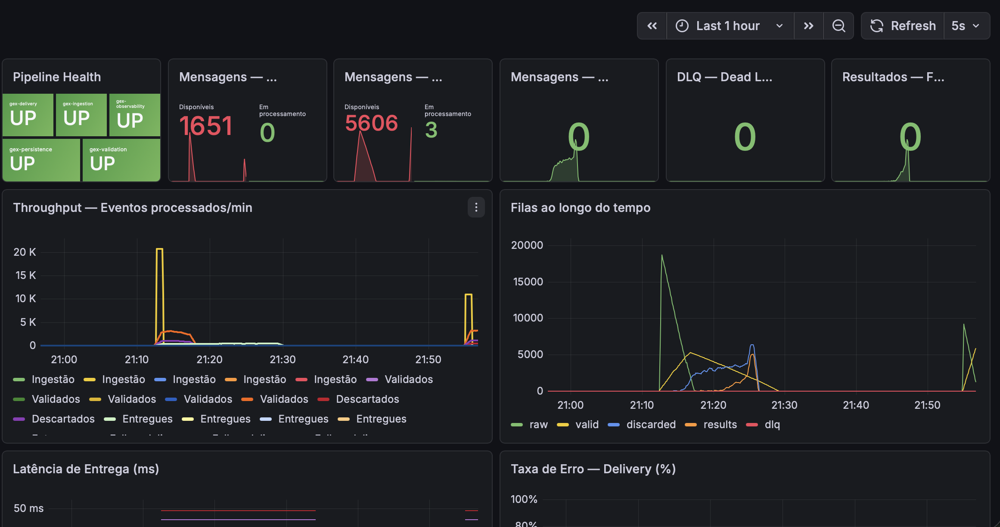
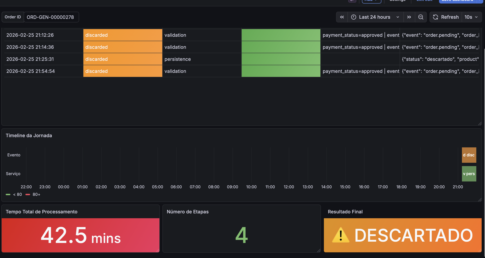

# GEX — Pipeline de Integração de Vendas

## Pré-requisitos

- Docker e Docker Compose
- Node.js 20+

---

## Setup

```bash
# 1. Copiar o env
cp .env.example .env

# 2. Copiar o CSV base
cp base_vendas_teste.csv "scripts/generate-batch/Base de Dados.csv"

# 3. Subir a stack
docker compose up --build
```

---

## Verificar saúde

```bash
curl http://localhost:3001/health          # ingestion
curl http://localhost:3005/health          # observability
curl http://localhost:3005/metrics/queues  # filas SQS
curl http://localhost:8080/health          # fake-api (webhook local)
```

---

## Enviando eventos

### 1 evento real-time

```bash
curl -X POST http://localhost:3001/events \
  -H "Content-Type: application/json" \
  -d '{
    "order_id": "ORD-TEST-001",
    "event": "order.approved",
    "customer_email": "john.smith@gmail.com",
    "customer_first_name": "John",
    "customer_last_name": "Smith",
    "customer_phone": "+18005551234",
    "customer_country": "US",
    "product_id": "PROD-001",
    "product_name": "Fit Burn",
    "product_niche": "weight_loss",
    "quantity": "3",
    "price_usd": "147",
    "payment_method": "credit_card",
    "payment_gateway": "cartpanda",
    "payment_status": "approved",
    "funnel_source": "facebook_ads",
    "utm_campaign": "fb_fitburn_cold",
    "created_at": "2026-02-10T14:32:00Z"
  }'
```

### Batch CSV (100 registros base)

```bash
curl -X POST http://localhost:3001/batch \
  -H "Content-Type: text/plain" \
  --data-binary @"scripts/generate-batch/Base de Dados.csv"
```

### Batch gerado (10k+)

```bash
# Gerar
cd scripts/generate-batch
node generate-batch.js           # 10.000 registros
node generate-batch.js 50000     # 50.000 registros
node generate-batch.js 1000000   # 1MM registros

# Enviar
curl -X POST http://localhost:3001/batch \
  -H "Content-Type: text/plain" \
  --data-binary @scripts/generate-batch/batch_10000.csv
```

### Simulador real-time

```bash
node scripts/simulate-realtime.js           # 100 eventos, 10/s
node scripts/simulate-realtime.js 500 5     # 500 eventos, 5/s
node scripts/simulate-realtime.js 2000 20   # 2000 eventos, 20/s
```

---

## Fake API (webhook local)

Simula o comportamento de uma API externa. Útil para testar resiliência sem depender do webhook.site.

```bash
curl -X POST localhost:8080/config/reallyfast  # sem erros, sem latência
curl -X POST localhost:8080/config/fast        # rápida, erros mínimos
curl -X POST localhost:8080/config/slow        # lenta, 40% respostas lentas
curl -X POST localhost:8080/config/unstable    # 20% erro, 10% timeout

curl http://localhost:8080/stats               # ver resultados
```

Para usar a fake-api como destino, configure no `.env`:
```
WEBHOOK_URL=http://fake-api:8080/webhook
```

---

## Métricas e Observabilidade

### Endpoints

| Endpoint | Descrição |
|---|---|
| `GET :3005/metrics/queues` | Mensagens em cada fila SQS |
| `GET :3005/metrics/summary` | Totais por status (enviado/erro/descartado) |
| `GET :3005/metrics/latency` | Latência p50/p95 venda→entrega |
| `GET :3005/metrics/error-rate` | Taxa de erro por hora |
| `GET :3005/metrics/pipeline-health` | Detecta pipeline parado >30min |
| `GET :3005/metrics/recent-errors` | Últimos 50 erros |
| `GET :3005/metrics/dlq` | Mensagens na Dead Letter Queue |
| `GET :3005/audit/:orderId` | Trilha completa de um pedido |

---

### Pipeline Monitor

Throughput, latência, taxa de erro e uso de recursos por serviço. Acesse em `http://localhost:3000` (admin/admin).



---

### Filas SQS

Tamanho de cada fila em tempo real com alerta visual quando a DLQ recebe mensagens.


---

### Audit Trail

Jornada completa de um pedido específico, do recebimento à entrega, com duração de cada etapa.


---

### Logs estruturados

Todos os serviços emitem logs em JSON com `order_id`, `correlation_id` e `duration_ms` para rastreamento ponta a ponta.

<!-- screenshot: logs.png -->


---

## Investigação de incidentes

Ver [`docs/RUNBOOK.md`](docs/RUNBOOK.md)

---

## Pontos de Melhoria

O foco desta entrega foi a infraestrutura, resiliência do pipeline e observabilidade. Os pontos abaixo ficam mapeados para uma próxima fase:

**Arquitetura de código**
Reorganizar os serviços seguindo Domain-Driven Design (DDD), com separação clara entre domain, application, infrastructure e interfaces. Aplicar princípios SOLID e Clean Code para facilitar manutenção e extensão.

**Testes**
Adicionar testes de unidade cobrindo validações de email/phone, enriquecimento de lead e regras de descarte. Testes de integração simulando o fluxo ponta a ponta com LocalStack e banco em memória.

**DLQ nas filas downstream**
Atualmente apenas a fila `gex-events-raw.fifo` possui Dead Letter Queue configurada. As filas `gex-leads-valid.fifo` e `gex-delivery-results` ainda não têm redrive policy — mensagens que falham repetidamente nessas etapas não são capturadas. A criação das DLQs correspondentes e a atualização do endpoint `/metrics/dlq` para monitorar todas elas está mapeada para a próxima fase.